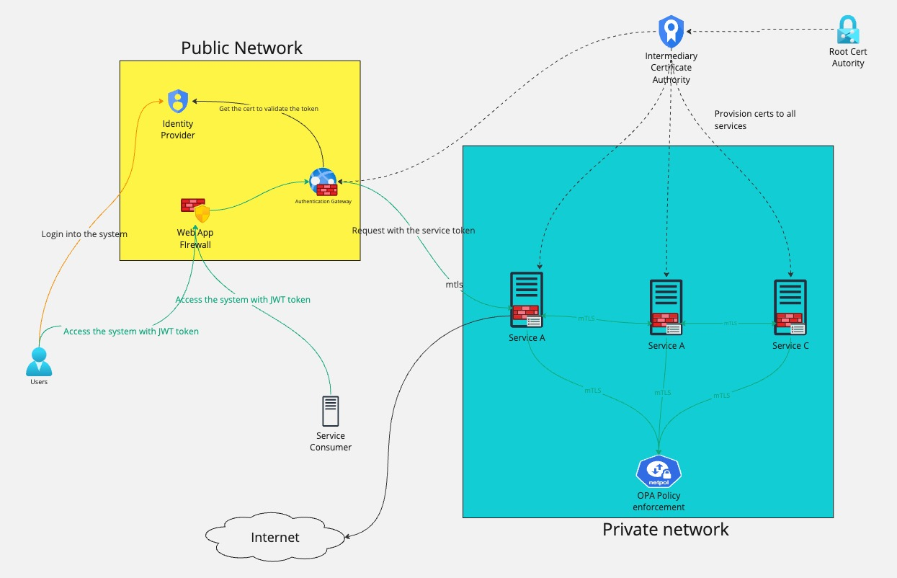

# Security Architecture
This open-source project demonstrates how to secure services using a variety of security mechanisms. It integrates several key technologies to enforce authentication, authorization, and secure communication between services. The primary components and technologies used in this project include:

- Mutual TLS: Ensures secure communication between services by using mutual authentication.
- Keycloak: Manages authentication and authorization, with support for OpenID Connect and JWT tokens.
- Open Policy Agent (OPA): Enforces fine-grained policies for service-to-service and user access control.
- Nginx: Acts as a reverse proxy and handles client certificate authorization and JWT validation.
- Client Certificates Authorization: Enhances security by requiring client certificates for service access.
- OpenID Connect: Used for user authentication, allowing integration with identity providers.
- JWT (JSON Web Tokens): Used for secure token-based authentication and authorization.
- Service-to-Service Authentication: Implemented using the client credentials grant type in Keycloak.




## Setup
- `./provisioning.sh`
- `docker-compose up`


## Authentication
Authentication is done using [Keycloak](https://www.keycloak.org/). The Keycloak clients are defined in the realm file inside `keycloak/`. 

Two clients are defined:
- `appTest-login-client` - This client is used to authenticate users using OpenID Connect
- `client_credentials-test` - This client is used to authenticate services using client credentials

Keycloak Console URL: http://localhost:9000 - credential: admin/password

### Authentication flow (Keycloak)
- Go to [Login page](http://127.0.0.1:9000/realms/tenantA/protocol/openid-connect/auth?scope=openid&response_type=code&client_id=appTest-login-client&redirect_uri=http://localhost:8002/auth_redirect&client_secret=vCjAY0XKadXE3n4xFUb7MGDvVJ1iVVPY&application_type=web_app)
- After login, the user will be redirected to a callback page with an authorization code which can be used to retrieve a Jwt token.


### Client credentials
We created a client credentials client in the keycloak to demonstrate how to authenticate using client credentials.
This type of client is used to authenticate services.

Create a token using client credentials to authenticate services.
```
curl -X POST "http://localhost:9000/realms/tenantA/protocol/openid-connect/token" \
     -H "Content-Type: application/x-www-form-urlencoded" \
     -d "grant_type=client_credentials" \
     -d "client_id=client_credentials-test" \
     -d "client_secret=your-client-secret-here"
```

## Authorization

### Service-to-service authorization
Service-to-service authorization is performed in two levels:
- Service-to-service communication using mutual TLS with Nginx
- Service access control using [Open Policy Agent(OPA)](https://www.openpolicyagent.org/)

### User access control
User access control is done using JWT tokens.
We use three strategies to validate JWT tokens:
- Retrieve the certs from the Keycloak server and validate the token
- Use x5t(Thumbprint) embedded in the token to retrieve the public key from a local truststore and validate the token
- Using embedded certificate to validate the token after validating the certificate against a CA

See the `nginx/njs/token.js`

### OPA
The OPA policies are defined in the `opa/` directory.
OPA is used to enforce policies for service-to-service communication and for user access control.

## Certificate management
The project uses shell script to simulate the certificate authority and generate certificates for services.
The certificates are generated using the `./provisioning.sh` script. The certificates are generated in the `certificates/gen` directory.

### Calling services with certificates
From the host machine, you can call the service using the following command:
```
curl --insecure  --cacert certificates/gen/ca.crt --cert certificates/gen/serviceA/client.crt --key certificates/gen/serviceA/client.key https://localhost
```
Inside the container, you can call the service using the following command:
```
curl --insecure  --cacert /etc/nginx/certs/ca.crt --cert /etc/nginx/certs/client.crt --key /etc/nginx/certs/client.key https://serviceB.local
```

### Update certificates
Server certificates can be updated without restarting the service by running the following command:
```
curl --insecure  https://localhost/certs --cacert certificates/gen/ca.crt --cert certificates/gen/serviceB/client.crt --key certificates/gen/serviceB/client.key -F cert=@certificates/gen/serviceA/client.crt -F key=@certificates/gen/serviceA/client.key
```
